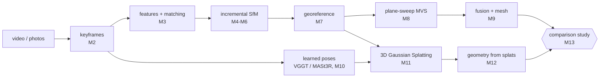
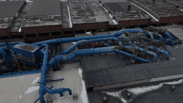
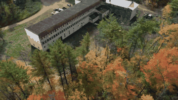
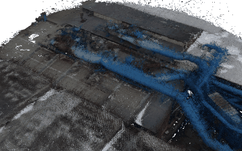
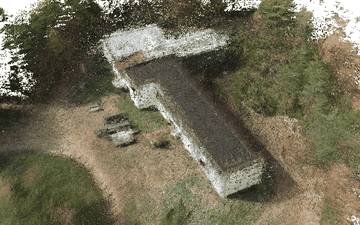
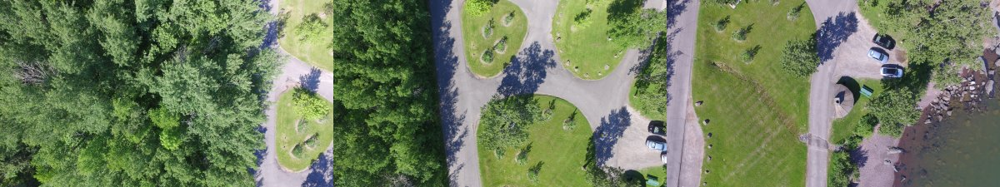
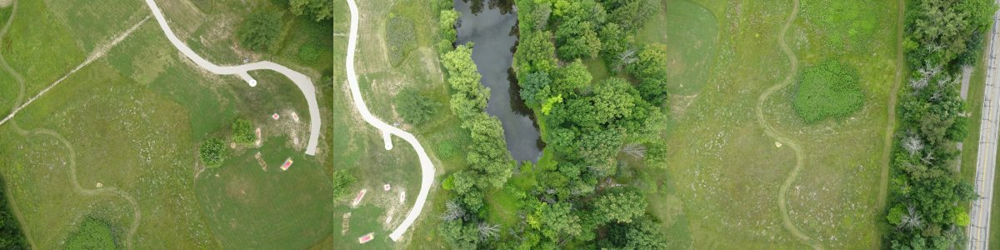
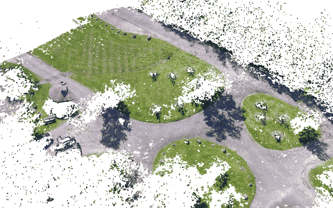
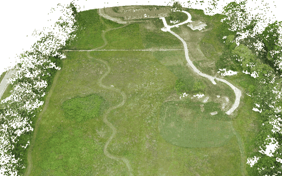

# aerial-recon

Learning 3D reconstruction from aerial drone imagery by building both major pipelines
from first principles, then comparing them on the same scenes.



**Classical track:** You implement SfM and MVS yourself (SO(3), epipolar geometry,
RANSAC, triangulation, bundle adjustment, PnP, incremental mapping, plane sweep, and depth
fusion). COLMAP runs alongside as the answer key.
**Modern track:** You use off-the-shelf learned pose estimators and the `gsplat` library,
and put the effort into what aerial data demands: appearance changes, pose refinement,
scale, and 8 GB of VRAM.

## Results

### Drone Video (no GPS)

| [Roof](https://vimeo.com/1153105848) | [Warehouse](https://vimeo.com/481823336) |
|---|---|
|  |  |
|  |  |

*Top: 10 s of each input video from 1:00. Bottom: the fused MVS point cloud on a
turntable, cropped to the drone's orbit.*

| metric | Roof | Warehouse |
|---|---|---|
| input | 145 s, 2560×1440, 60 fps | 137 s, 2560×1440, 60 fps |
| keyframes (`keyframes --target 180`) | 165, one per 0.87 s | 156, one per 0.85 s |
| orbit coverage, camera pitch | 1.3 laps (471°), 45° down | 3.0 laps (1096°), 42° down |
| SfM registered | 165 / 165 | 156 / 156 |
| sparse points, mean track length | 138k, 10.0 | 55k, 6.7 |
| mean reprojection error | 0.56 px | 0.72 px |
| level: camera-height spread, max \|roll\| | 0.7 %, 1.2° | 4.8 %, 0.7° |
| MVS valid depth per view (mean) | 88 % | 72 % |
| median ZNCC of the winning depth | 0.86 | 0.63 |
| fused points (voxel = 4 GSD) | 3.9M | 2.9M |
| SfM point → dense cloud: median, ≤ 4 GSD, ≤ 8 GSD | 1.9 GSD, 95.1 %, 98.3 % | 1.9 GSD, 97.1 %, 99.0 % |
| Poisson mesh, depth 10 | 1.4M vertices, 2.7M triangles | 2.9M vertices, 5.9M triangles |
| CPU time: COLMAP, MVS depth + fusion | 13 min, 28 + 16 min | 8 min, 24 + 10 min |

There is no ground truth for either video (no GPS, no LiDAR), so these are consistency
checks, not accuracy. The last check (`aerial-recon crosscheck`) measures how far each
COLMAP point, triangulated from feature tracks independently of MVS, is from the fused
cloud, in ground-sampling distances (≈ pixels at 1600 px). The 1.9 GSD median sits near
the floor that the 4 GSD voxel spacing allows. The warehouse scores lower on valid depth
and ZNCC because of trees, which move and repeat.

### Aerial Imagery

| Brighton Beach (ODM, 18 photos) | Aukerman (ODM, 77 photos) |
|---|---|
|  |  |
|  |  |

*Top: three input photos from each set. Bottom: the fused MVS point cloud in GPS-aligned
ENU metres on a turntable (Aukerman shows a random 6M of its 20M points). Both come from
this repo's own pipeline: `sfm` (8-point) → `georef` → `mvs`.*

| metric | Brighton Beach | Aukerman |
|---|---|---|
| input | 18 DJI photos, 4000×2250, EXIF GPS | 77 Sony photos, 4896×3672, EXIF GPS |
| SfM registered | 18 / 18 | 76 / 77 |
| sparse points, mean track length | 9.4k, 2.8 | 46k, 3.6 |
| bundle adjustment reprojection RMSE | 0.87 px | 1.28 px |
| poses vs COLMAP: ATE RMSE (Sim3-aligned) | 3.4 cm | 31 cm |
| poses vs COLMAP: pairwise AUC @ 5°, median rot. / transl. error | 0.981, 0.08° / 0.06° | 0.950, 0.18° / 0.13° |
| GPS residual RMSE after `georef` (COLMAP model) | 0.42 m (0.43 m) | 1.10 m (1.13 m) |
| MVS resolution, valid depth per view, median ZNCC | 1600×900, 66 %, 0.60 | 1600×1200, 80 %, 0.68 |
| fused points (voxel) | 2.3M (5 cm) | 20.4M (10 cm) |
| SfM point → dense cloud: median, ≤ 2 GSD, ≤ 4 GSD | 0.78 GSD, 82.7 %, 94.8 % (GSD 4.2 cm) | 0.76 GSD, 73.8 %, 83.9 % (GSD 8.6 cm) |
| COLMAP sparse → dense cloud after ICP: median, ≤ 10 cm | — | 5.6 cm, 83 % |
| vs ODM `model.laz` after ICP: F-score @ 10 / 20 cm | 0.42 / 0.61 | — (no reference) |
| CPU time: SfM, MVS depth + fusion | 39 s (cached features), 5 min | 92 min, 19 + 11 min |

COLMAP is the pose reference, so the ATE is converted to metres with COLMAP's own GPS
scale. The own-SfM model fits GPS as well as COLMAP's does (the values in brackets). The
ODM cloud is photogrammetric too, so the F-score measures agreement, not accuracy. Before
ICP, the EXIF altitude datum puts the cloud about 10 m below ODM's. On Brighton, most
depth failures are in the tree canopy, which shows up as holes in the turntable.

## Bringup

```bash
uv sync --extra colmap --extra dev          # core + pycolmap reference + pytest
uv run pytest tests/scaffold                # infrastructure: passes out of the box
uv run aerial-recon status                  # milestone progress (student tests)
uv run aerial-recon download brighton_beach # 18 DJI images, ~80 MB
uv run aerial-recon colmap data/brighton_beach/images --out outputs/brighton_beach/colmap
```

Optional extras: `--extra mesh` (Open3D Poisson meshing, M9), `--extra splat` (torch +
gsplat, M11), `--extra eval` (LPIPS, plots, and `laspy`/`pyproj` for LAZ references).

### Classical pipeline end to end (M6–M9)

```bash
B=outputs/brighton_beach
uv run aerial-recon sfm data/brighton_beach/images --intrinsics $B/colmap/sparse_txt \
    --out $B/sfm_8pt --cache $B/features_1600_8k.npz          # add --five-point / --focal-from-exif
uv run aerial-recon compare-poses $B/sfm_8pt $B/colmap/sparse_txt --json $B/sfm_8pt/pose_metrics.json
uv run aerial-recon georef $B/sfm_8pt data/brighton_beach/images --out $B/sfm_8pt_enu
uv run aerial-recon mvs $B/sfm_8pt_enu data/brighton_beach/images --out $B/mvs_sfm_8pt [--mesh]
uv run aerial-recon eval-geometry $B/mvs_sfm_8pt/fused.npz --reference data/brighton_beach/model.laz \
    --georef $B/sfm_8pt_enu/georef.json --out $B/mvs_sfm_8pt/geometry_metrics.json
```

`--cache` stores keypoints and all raw matches, so reruns (and `--sequential N` subsets)
skip feature extraction and matching. `eval-geometry` reports metrics after GPS alignment
and after ICP refinement, cropped to the reference footprint. Pick `mvs --voxel` close to
the ground sampling distance at the MVS resolution (Brighton 4 cm → 0.05; Aukerman 9 cm →
0.1): finer voxels only multiply memory. `mvs --reuse-depth` resumes after a fusion crash.

Mesh an existing cloud with `uv run aerial-recon mesh $B/mvs_sfm_8pt/fused.npz` (needs
`--extra mesh`; outlier removal, screened Poisson at depth 11, then density trimming).
Large clouds: add `--voxel 0.2` first (Aukerman: 20M -> 4.6M points, 4.5 GB peak). Depth 12
on Brighton takes about 5.8 GB. Note that `uv sync --extra X` *removes* extras you don't
list, so sync them together: `uv sync --extra colmap --extra dev --extra mesh`.

```bash
V=warehouse_drone_orbit; O=outputs/$V
uv run aerial-recon keyframes data/video/$V --out data/$V/images --target 180   # M2
uv run aerial-recon colmap data/$V/images --out $O/colmap --max-size 1920
uv run aerial-recon level $O/colmap/sparse_txt --out $O/colmap_level            # z-up, centred
uv run aerial-recon mvs $O/colmap_level data/$V/images --out $O/mvs --voxel 0
uv run aerial-recon mesh $O/mvs/fused.npz --depth 10 --out $O/mvs/mesh_d10.ply
uv run aerial-recon crosscheck $O/colmap_level $O/mvs --json $O/mvs/crosscheck.json
```

`keyframes` scores every frame (Laplacian sharpness, LK median flow at 640 px), sets the
motion threshold to total flow / `--target`, and writes the chosen frames at 1920 px.
Video frames carry no EXIF GPS, so `georef` cannot run; `level` instead rotates the model
so up is +z (a gimballed camera has ~zero roll, so up is orthogonal to every camera
x-axis) and moves the origin to the median sparse point. Units stay arbitrary, so
`mvs --voxel 0` picks the voxel as `--auto-voxel-gsd` (4) × the median ground sampling
distance. One GSD is too fine for a dense orbit: 165 views of one scene put nearly every
raw point in its own voxel and fusion ran out of RAM.

Results on the two 2560×1440 60 fps orbits in `data/video` (CPU only, MVS at 1600×900):

| video | keyframes | COLMAP registered / points / reproj. | COLMAP | MVS depth + fusion | fused points |
|---|---|---|---|---|---|
| drone_roof_orbit | 165 of 8673 | 165 / 138k / 0.56 px | 13 min | 28 + 16 min | 3.9M |
| warehouse_drone_orbit | 156 of 8234 | 156 / 55k / 0.72 px | 8 min | 24 + 10 min | 2.9M |

Both levelled orbits have camera-height spread under 5 % of the height above the
scene and |roll| under 1.3°, a good sign that the up estimate is right.

## How to work a milestone

1. Read the milestone in [docs/roadmap.md](docs/roadmap.md) and its reading in
   [docs/theory.md](docs/theory.md).
2. Open the stub modules listed for it. Each docstring states the contract, the math, and
   the traps.
3. `uv run pytest tests/student -k m03 -x` until it is green. The tests use synthetic
   scenes with exact ground truth ([synthetic.py](src/aerial_recon/synthetic.py)).
4. Run the milestone's real-data gate, e.g. `aerial-recon sfm` → `aerial-recon compare-poses`
   against COLMAP.
5. Write down what surprised you. The study write-up is built from these notes.

Every student test has been checked against a private reference implementation, including
the real-data SfM gate on Brighton Beach. Slow end-to-end tests are marked `slow`
(`aerial-recon status --fast` skips them).

## Milestones

| # | Milestone | You implement | Gate |
|---|-----------|---------------|------|
| M0 | Bringup, conventions | — | COLMAP reference of Brighton Beach viewed in 3D |
| M1 | Camera geometry & SO(3) | `geometry/rotations.py`, `geometry/camera.py` | `-k m01` |
| M2 | Video → keyframes | `video/frames.py` | `-k m02` + a real video |
| M3 | Features, matching, RANSAC, H | `sfm/features.py`, `geometry/{ransac,homography}.py` | `-k m03` |
| M4 | Two-view geometry | `geometry/{epipolar,triangulation}.py` | `-k m04` |
| M5 | Bundle adjustment | `sfm/bundle_adjustment.py` | `-k m05` |
| M6 | Incremental SfM | `geometry/pnp.py`, `sfm/{tracks,incremental}.py` | `-k m06` + 18/18 on Brighton Beach |
| M7 | Georeferencing & pose metrics | `geometry/alignment.py`, `geo/geodesy.py`, `eval/poses.py` | `-k m07` + GPS-aligned model |
| M8 | Plane-sweep MVS | `mvs/plane_sweep.py` (stretch: `mvs/patchmatch.py`) | `-k m08` |
| M9 | Fusion & geometry metrics | `mvs/fusion.py`, `eval/geometry.py` | `-k m09` + mesh of Aukerman |
| M10 | Learned poses | run VGGT / MASt3R-SfM / GLOMAP | pose-accuracy table |
| M11 | 3DGS on drone data | `modern/splat.py` | held-out PSNR/LPIPS |
| M12 | Geometry from splats | depth render → fusion / 2DGS | F-score vs MVS |
| M13 | Comparison study | configs + write-up | [docs/study.md](docs/study.md) |

## Layout

```
src/aerial_recon/
  types.py           Camera, Pose, Image, Point3D, Reconstruction   (scaffold)
  synthetic.py       drone trajectories, terrain, slab renderer, GT (scaffold)
  io/                COLMAP text I/O, PLY, EXIF GPS                  (scaffold)
  geometry/          rotations, camera, RANSAC, H, F/E, triangulation, PnP, Sim3  (M1-M7)
  video/frames.py    extraction (scaffold); sharpness, keyframes     (M2)
  sfm/               SIFT (scaffold), matching, tracks, BA, incremental, COLMAP ref
  geo/geodesy.py     WGS84 → ECEF → ENU                              (M7)
  geo/level.py       z-up levelling without GPS (video)
  mvs/               warp (scaffold), plane sweep, PatchMatch, fusion, meshing (scaffold)
  modern/            pose sources (scaffold), gsplat trainer         (M10-M11)
  eval/              pose, geometry, image metrics
tests/scaffold/      passes now
tests/student/       one file per milestone — your gates
docs/                roadmap, theory, datasets, conventions, study design
```

## Hardware notes (this machine)

RTX 3060 Ti with 8 GB, and about 7.7 GB of RAM visible to WSL. If the Windows host has
more RAM, raise the WSL limit in `%UserProfile%\.wslconfig` (`[wsl2]` / `memory=16GB`)
before M9–M11. Defaults are sized for this machine: SfM at 1600 px, 8k features, 3DGS at
¼ resolution.
