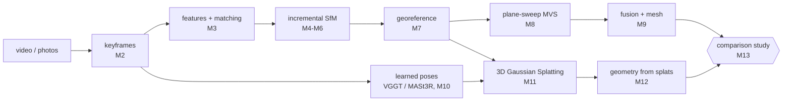

# aerial-recon

Learning 3D reconstruction from aerial drone imagery by building both major pipelines
from first principles, then comparing them on the same scenes.



**Classical track:** You implement SfM and MVS yourself (SO(3), epipolar geometry,
RANSAC, triangulation, bundle adjustment, PnP, incremental mapping, plane sweep, and depth
fusion). COLMAP runs alongside as the answer key.
**Modern track:** You use off-the-shelf learned pose estimators and the `gsplat` library,
and put the effort into what aerial data demands: appearance changes, pose refinement,
scale, and 8 GB of VRAM.

## Bringup

```bash
uv sync --extra colmap --extra dev          # core + pycolmap reference + pytest
uv run pytest tests/scaffold                # infrastructure: passes out of the box
uv run aerial-recon status                  # milestone progress (student tests)
uv run aerial-recon download brighton_beach # 18 DJI images, ~80 MB
uv run aerial-recon colmap data/brighton_beach/images --out outputs/brighton_beach/colmap
```

Optional extras: `--extra mesh` (Open3D Poisson meshing, M9), `--extra splat` (torch +
gsplat, M11), `--extra eval` (LPIPS, plots, and `laspy`/`pyproj` for LAZ references).

### Classical pipeline end to end (M6–M9)

```bash
B=outputs/brighton_beach
uv run aerial-recon sfm data/brighton_beach/images --intrinsics $B/colmap/sparse_txt \
    --out $B/sfm_8pt --cache $B/features_1600_8k.npz          # add --five-point / --focal-from-exif
uv run aerial-recon compare-poses $B/sfm_8pt $B/colmap/sparse_txt --json $B/sfm_8pt/pose_metrics.json
uv run aerial-recon georef $B/sfm_8pt data/brighton_beach/images --out $B/sfm_8pt_enu
uv run aerial-recon mvs $B/sfm_8pt_enu data/brighton_beach/images --out $B/mvs_sfm_8pt [--mesh]
uv run aerial-recon eval-geometry $B/mvs_sfm_8pt/fused.npz --reference data/brighton_beach/model.laz \
    --georef $B/sfm_8pt_enu/georef.json --out $B/mvs_sfm_8pt/geometry_metrics.json
```

`--cache` stores keypoints and all raw matches, so reruns (and `--sequential N` subsets)
skip feature extraction and matching. `eval-geometry` reports metrics after GPS alignment
and after ICP refinement, cropped to the reference footprint. Pick `mvs --voxel` close to
the ground sampling distance at the MVS resolution (Brighton 4 cm → 0.05; Aukerman 9 cm →
0.1): finer voxels only multiply memory. `mvs --reuse-depth` resumes after a fusion crash.

## How to work a milestone

1. Read the milestone in [docs/roadmap.md](docs/roadmap.md) and its reading in
   [docs/theory.md](docs/theory.md).
2. Open the stub modules listed for it. Each docstring states the contract, the math, and
   the traps.
3. `uv run pytest tests/student -k m03 -x` until it is green. The tests use synthetic
   scenes with exact ground truth ([synthetic.py](src/aerial_recon/synthetic.py)).
4. Run the milestone's real-data gate, e.g. `aerial-recon sfm` → `aerial-recon compare-poses`
   against COLMAP.
5. Write down what surprised you. The study write-up is built from these notes.

Every student test has been checked against a private reference implementation, including
the real-data SfM gate on Brighton Beach. Slow end-to-end tests are marked `slow`
(`aerial-recon status --fast` skips them).

## Milestones

| # | Milestone | You implement | Gate |
|---|-----------|---------------|------|
| M0 | Bringup, conventions | — | COLMAP reference of Brighton Beach viewed in 3D |
| M1 | Camera geometry & SO(3) | `geometry/rotations.py`, `geometry/camera.py` | `-k m01` |
| M2 | Video → keyframes | `video/frames.py` | `-k m02` + a real video |
| M3 | Features, matching, RANSAC, H | `sfm/features.py`, `geometry/{ransac,homography}.py` | `-k m03` |
| M4 | Two-view geometry | `geometry/{epipolar,triangulation}.py` | `-k m04` |
| M5 | Bundle adjustment | `sfm/bundle_adjustment.py` | `-k m05` |
| M6 | Incremental SfM | `geometry/pnp.py`, `sfm/{tracks,incremental}.py` | `-k m06` + 18/18 on Brighton Beach |
| M7 | Georeferencing & pose metrics | `geometry/alignment.py`, `geo/geodesy.py`, `eval/poses.py` | `-k m07` + GPS-aligned model |
| M8 | Plane-sweep MVS | `mvs/plane_sweep.py` (stretch: `mvs/patchmatch.py`) | `-k m08` |
| M9 | Fusion & geometry metrics | `mvs/fusion.py`, `eval/geometry.py` | `-k m09` + mesh of Aukerman |
| M10 | Learned poses | run VGGT / MASt3R-SfM / GLOMAP | pose-accuracy table |
| M11 | 3DGS on drone data | `modern/splat.py` | held-out PSNR/LPIPS |
| M12 | Geometry from splats | depth render → fusion / 2DGS | F-score vs MVS |
| M13 | Comparison study | configs + write-up | [docs/study.md](docs/study.md) |

## Layout

```
src/aerial_recon/
  types.py           Camera, Pose, Image, Point3D, Reconstruction   (scaffold)
  synthetic.py       drone trajectories, terrain, slab renderer, GT (scaffold)
  io/                COLMAP text I/O, PLY, EXIF GPS                  (scaffold)
  geometry/          rotations, camera, RANSAC, H, F/E, triangulation, PnP, Sim3  (M1-M7)
  video/frames.py    extraction (scaffold); sharpness, keyframes     (M2)
  sfm/               SIFT (scaffold), matching, tracks, BA, incremental, COLMAP ref
  geo/geodesy.py     WGS84 → ECEF → ENU                              (M7)
  mvs/               warp (scaffold), plane sweep, PatchMatch, fusion, meshing (scaffold)
  modern/            pose sources (scaffold), gsplat trainer         (M10-M11)
  eval/              pose, geometry, image metrics
tests/scaffold/      passes now
tests/student/       one file per milestone — your gates
docs/                roadmap, theory, datasets, conventions, study design
```

## Hardware notes (this machine)

RTX 3060 Ti with 8 GB, and about 7.7 GB of RAM visible to WSL. If the Windows host has
more RAM, raise the WSL limit in `%UserProfile%\.wslconfig` (`[wsl2]` / `memory=16GB`)
before M9–M11. Defaults are sized for this machine: SfM at 1600 px, 8k features, 3DGS at
¼ resolution.
